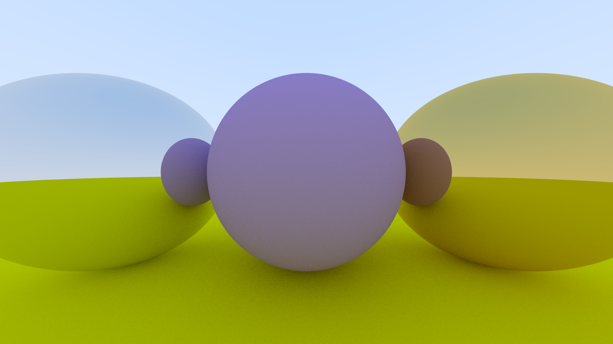

# RayTracingWeekend
Repositoy for my implementation of Peter Shirley's Ray Tracing in One Weekend
https://raytracing.github.io/books/RayTracingInOneWeekend.html

Note that the scene is software rendered (on the CPU), I might revisit this for hardware rendering the scene (OpenGL on the GPU).

## Example image

